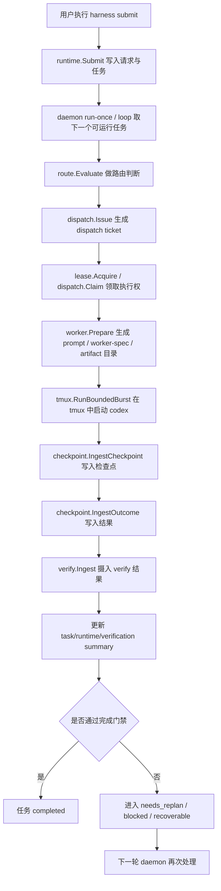

# 项目整体流程说明

本文基于当前仓库实现，说明 `Klein-Harness` 的整体工作流、关键模块分工，以及任务从提交到完成的闭环路径。

## 1. 项目是什么

`Klein-Harness` 是一个 repo-local agent runtime。

它的核心思想是：

- 用 `harness` 作为唯一规范 CLI
- 用 Go 代码维护控制面和状态机
- 用真实 `tmux` 作为执行壳
- 用真实 `codex exec` / `codex exec resume` 作为 worker 执行器
- 所有关键状态、工件、验证结果都落在仓库内的 `.harness/` 下

也就是说，这个项目不是“靠 prompt 记住上下文”的 agent 脚本，而是一个把任务、状态、调度、验证、恢复都显式写入仓库的运行时系统。

## 2. 整体主链路

最核心的执行路径如下：

对应 README 中描述的 canonical path：

1. `harness submit`
2. `harness daemon run-once`
3. route task
4. issue dispatch
5. acquire and claim lease
6. create real tmux session
7. run native codex inside tmux
8. persist checkpoint and outcome
9. ingest verify
10. expose query/control state

## 3. 分阶段说明

### 阶段一：初始化与任务提交

入口命令：

- `harness init <ROOT>`
- `harness submit <ROOT> --goal "..."`

这一阶段主要由 `internal/bootstrap` 和 `internal/runtime.Submit` 完成。

它会做几件事：

- 初始化 repo-local 的 `.harness/` 目录
- 生成新的 `taskId` 与 `requestId`
- 在 `.harness/task-pool.json` 中写入任务
- 在 `.harness/requests/queue.jsonl` 中追加请求记录
- 更新 `.harness/state/runtime.json`

此时任务状态通常是：

- `queued`

## 阶段二：daemon 取任务并进入路由

入口命令：

- `harness daemon run-once <ROOT>`
- `harness daemon loop <ROOT>`

这一阶段由 `internal/runtime.RunOnce` 驱动。

它会：

- 从 `task-pool` 里挑选下一个可运行任务
- 将任务状态临时切到 `routing`
- 读取 plan epoch、checkpoint、新旧 session 绑定等上下文
- 调用 `internal/route.Evaluate`

`route` 的核心职责不是生成代码，而是先判断这个任务现在是否允许进入执行：

- 是否 plan 已过期
- 是否必须先 checkpoint
- 是否缺 worktree / ownedPaths
- 是否可以安全 resume 旧 session
- 是否应该 fresh dispatch

典型路由结果有：

- `dispatch`
- `resume`
- `replan`
- `block`

如果不能 dispatch，任务会转成：

- `needs_replan`
- `blocked`

## 阶段三：生成 dispatch 与领取执行权

当 route 判断可执行后，runtime 会继续调用：

- `internal/dispatch.Issue`
- `internal/lease.Acquire`
- `internal/dispatch.Claim`

这一层的含义是把“可以做”变成“这一次具体谁来做、做什么、做多久”。

这里会生成：

- dispatch ticket
- lease 记录
- dispatch claim

它解决的是控制面问题：

- 这次执行的唯一 ID 是什么
- 当前 worker 是否真的持有执行权
- 是否允许旧结果覆盖新结果
- 哪个 dispatch 才是当前任务的合法最新尝试

## 阶段四：准备 worker 执行包

这一步由 `internal/worker.Prepare` 完成。

它会在任务的 artifact 目录中准备 worker 所需全部材料，包括：

- `dispatch-ticket`
- `worker-spec.json`
- `runner prompt`
- `planning trace`
- `worker-result.json` 的目标位置
- `verify.json` 的目标位置
- `handoff.md` 的目标位置

这一步非常关键，因为它把“运行时的判断”翻译成“worker 可以执行的边界”。

其中会明确写出：

- objective
- selected plan
- constraints
- owned paths / blocked paths
- verification plan
- validation hooks
- outer loop memory
- replan triggers

所以 worker 不是自由发挥，而是在一个受限、可审计的 ticket + spec 下工作。

## 阶段五：在 tmux 中启动真实 codex worker

执行由 `internal/tmux` 和 `internal/executor/codex` 配合完成。

核心方式是：

- fresh 模式走 `codex exec`
- resume 模式走 `codex exec resume <SESSION_ID>`
- 用真实 tmux session 承载执行过程

也就是说：

- `tmux` 只负责会话和进程承载
- `codex` 只负责模型执行
- 调度和状态判断仍然由 Go runtime 负责

运行过程中会产出：

- tmux log
- checkpoint
- outcome
- worker closeout artifacts

## 阶段六：checkpoint / outcome 摄入

执行完成后，runtime 会把这次 burst 的结果回写到控制面：

- `checkpoint.IngestCheckpoint`
- `checkpoint.IngestOutcome`

这一步的作用是把 worker 的一次执行变成可恢复、可审计、可追踪的系统记录。

典型信息包括：

- 第几次 attempt
- 对应哪个 dispatch / lease
- 当前执行状态是否 succeeded / failed / timed_out
- diff 统计
- 产物路径
- 下一步是否建议 `replan`

如果 burst 失败或超时，runtime 通常会把下一步建议设为：

- `replan`

## 阶段七：验证与完成门禁

这一阶段由 `internal/verify` 负责。

runtime 会先从 artifact 目录推导验证状态：

- 优先读取 `verify.json`
- 如果 burst 已失败或超时，则直接判为验证失败
- 如果 `verify.json` 缺失或格式错误，也会视为失败

随后通过 `verify.Ingest` 把结果写回验证面。

验证阶段不只是“测没测试过”，它还负责：

- 记录验证结论
- 生成 follow-up event
- 决定是否进入 completion gate
- 需要时记录 outer-loop memory，供后续 replan 使用

如果满足完成条件，任务会进入：

- `completed`

如果不满足，则可能进入：

- `needs_replan`
- `blocked`

## 阶段八：失败后的回流闭环

这个项目不是“一次跑完就结束”，而是一个闭环状态机。

当发生以下情况时，会自动回流：

- burst failed
- burst timed out
- verify failed
- verify blocked
- closeout artifacts 缺失
- ownedPaths 越界

回流后的处理模式通常是：

1. 记录反馈或 outer-loop memory
2. 将任务状态切为 `needs_replan` 或 `blocked`
3. 必要时提升 `planEpoch`
4. 下次 daemon tick 再重新 route / dispatch

这就是 README 和架构文档里强调的 re-entrant runtime：

- 一次输出可以成为下一次输入
- 验证失败不会只停留在日志里，而会重新回到调度系统

## 4. 控制面三层状态

项目把状态拆成三层。

### 1. Cold evidence

原始证据与追加日志，主要用于审计、RCA、定向排查：

- `.harness/requests/queue.jsonl`
- `.harness/lineage.jsonl`
- `.harness/feedback-log.jsonl`
- `.harness/root-cause-log.jsonl`
- `.harness/state/runner-logs/*.log`

### 2. Runtime ledgers

调度与执行的源事实：

- `.harness/state/request-index.json`
- `.harness/state/request-task-map.json`
- `.harness/task-pool.json`
- `.harness/session-registry.json`

### 3. Hot summaries

给 operator、runtime、worker 快速读取的摘要面：

- `.harness/state/runtime.json`
- `.harness/state/request-summary.json`
- `.harness/state/task-summary.json`
- `.harness/state/worker-summary.json`
- `.harness/state/lease-summary.json`
- `.harness/state/dispatch-summary.json`
- `.harness/state/checkpoint-summary.json`
- `.harness/state/completion-gate.json`
- `.harness/state/guard-state.json`

可以简单理解为：

- cold evidence = 原始流水
- runtime ledgers = 可变真相
- hot summaries = 快速视图

## 5. 关键模块分工

按当前代码结构，主职责大致如下：

- `cmd/harness`
  - 统一 CLI 入口
- `internal/bootstrap`
  - 初始化 `.harness` 结构
- `internal/runtime`
  - 主调度器，串起 submit / run-once / loop / control
- `internal/route`
  - 路由决策，判断 dispatch / resume / replan / block
- `internal/dispatch`
  - 生成 dispatch ticket，管理 dispatch 生命周期
- `internal/lease`
  - 管理任务执行权，防止并发冲突
- `internal/worker`
  - 生成 worker 执行包与 prompt
- `internal/tmux`
  - 创建与管理 tmux session，承载真实执行
- `internal/executor/codex`
  - 构造 `codex exec` / `codex exec resume` 命令
- `internal/checkpoint`
  - 写入 checkpoint / outcome
- `internal/verify`
  - 摄入验证结果，维护 completion gate 和反馈闭环
- `internal/query`
  - 给 `tasks` / `task` / `control status` 提供查询视图

## 6. 你可以把它理解成什么

如果用一句话概括，这个项目的整体流程是：

“把用户目标先写成 repo-local task，再由 runtime 做路由和调度，用 tmux + codex 执行受控 worker，最后把 checkpoint、结果、验证、反馈重新写回仓库，形成一个可恢复、可验证、可再次进入下一轮执行的闭环控制系统。”

## 7. 最简操作视角

如果从使用者角度看，最短链路就是：

1. `harness submit` 提任务
2. `harness daemon run-once` 或 `loop` 跑调度
3. runtime 自动 route / dispatch / execute / verify
4. 用 `harness tasks` / `harness task` / `harness control` 查看与控制状态

所以对外是几条 CLI，对内其实是一套状态机。
